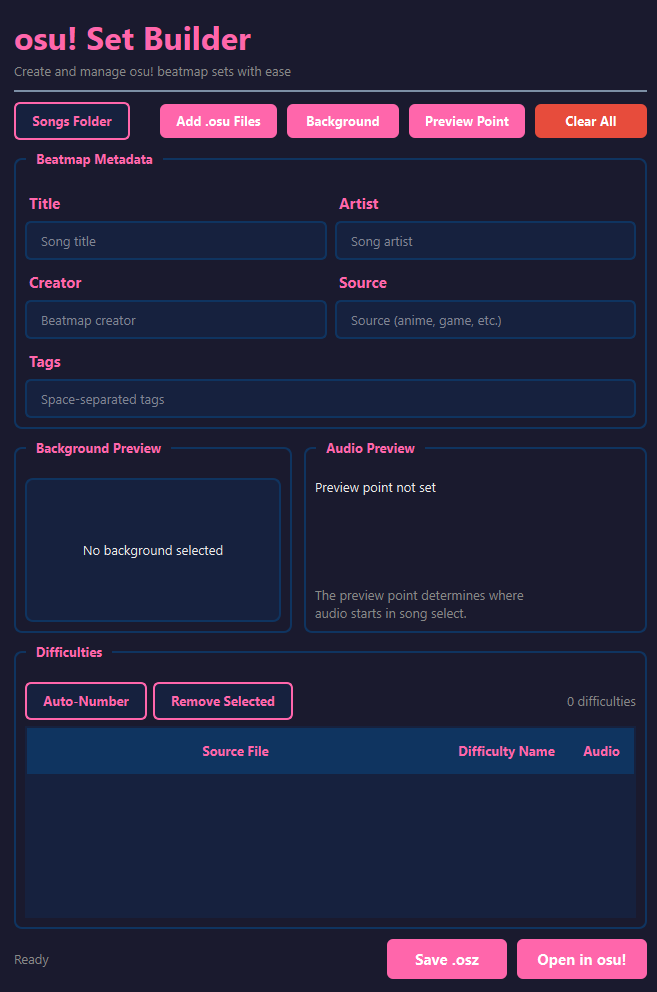

# osu! Set Builder

<div align="center">
  
  <br><br>

  [](https://python.org)
  [](LICENSE)

  Combine multiple `.osu` difficulty files into a single beatmap set.
</div>

## Overview

osu! Set Builder lets you merge multiple `.osu` files into one `.osz` package with shared metadata and assets. Useful when you have separate difficulty files and want to bundle them properly for submission or sharing.



## Features

- Merge multiple `.osu` files into a single set
- Edit metadata (title, artist, creator, source, tags) across all difficulties at once
- Set a shared background image
- Pick the audio preview point with an interactive player
- Export to `.osz` or open directly in osu!

## Installation

**Requirements:** Python 3.10+

```bash
git clone https://github.com/rosacry/osuSetBuilder.git
cd osuSetBuilder
pip install -r requirements.txt
python osu_set_builder.py
```

Or download the latest release from [Releases](https://github.com/rosacry/osuSetBuilder/releases).

## Usage

1. Click **Add .osu Files** to import your difficulty files
2. Fill in the metadata fields (or let them auto-populate from your files)
3. Set a background image and preview point if needed
4. Click **Save .osz** to export, or **Open in osu!** to import directly

> [!TIP]
> Use **Auto-Number** to quickly rename difficulties as "1", "2", "3", etc.

## Building from source

```bash
pip install pyinstaller
pyinstaller osu_set_builder.spec
```

The executable will be in `dist/`.

## License

[MIT](LICENSE)

## Acknowledgments

- [osu!](https://osu.ppy.sh) - The rhythm game this tool is built for
- [PySide6](https://doc.qt.io/qtforpython/) - Qt bindings for Python
- [PyInstaller](https://pyinstaller.org) - For creating standalone executables

## Contributing

Contributions are welcome! Please feel free to submit a Pull Request.

1. Fork the repository
2. Create your feature branch (`git checkout -b feature/AmazingFeature`)
3. Commit your changes (`git commit -m 'Add some AmazingFeature'`)
4. Push to the branch (`git push origin feature/AmazingFeature`)
5. Open a Pull Request

---

<p align="center">
  Made for the osu! community
</p>
